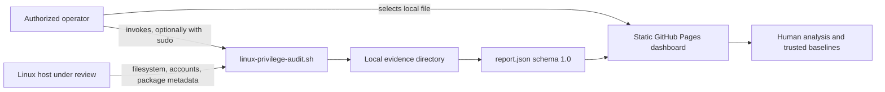
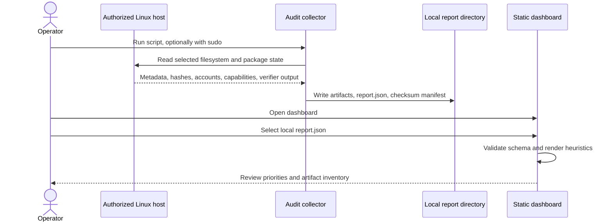

# Architecture

## Purpose

JusticeForMe separates host collection from report interpretation so that each responsibility has a small, inspectable boundary. The collector reads selected Linux security state and writes a local evidence bundle. The browser dashboard reads only the user-selected summary file and presents heuristic review priorities.

## System context



No network service, collector daemon, remote agent, upload endpoint, or automatic remediation component is implemented.

## Components

### Collector

`audit/linux-privilege-audit.sh` is a Bash program with strict shell error handling. It:

- creates a timestamped output directory;
- records `/etc` metadata and SHA-256 file hashes;
- identifies world-writable files and directories and executable regular files under `/etc`;
- enumerates setuid/setgid binaries within bounded executable roots;
- records Linux file capabilities when `getcap` is available;
- records UID 0 accounts, selected administrative groups, and sudo configuration metadata;
- records selected systemd, cron, and dynamic-loader persistence indicators;
- invokes one available package verifier from `dpkg`, `rpm`, or `pacman`;
- writes `report.json`; and
- creates `REPORT-SHA256SUMS.txt` for the generated bundle.

The collector is read-only with respect to the audited host state, but it necessarily writes its output directory.

### Evidence bundle

The output directory is the handoff boundary between collection and analysis. It contains detailed text artifacts and the compact JSON summary used by the dashboard. The checksum manifest protects against unnoticed post-collection changes only when it is preserved and independently verified; it is not a digital signature and does not establish who collected the evidence.

### Dashboard

`docs/index.html`, `docs/app.js`, and `docs/styles.css` form a static browser application. The dashboard:

- accepts a local JSON file through the browser file picker;
- requires `schema_version` value `1.0` and a `metrics` object;
- renders six summary metrics;
- applies fixed display thresholds; and
- lists the artifact names declared by the report.

The dashboard has no backend and does not transmit the selected file. Deployment through GitHub Pages publishes only the static `docs/` directory.

## Data flow



## Trust boundaries

### Boundary 1: operator to collector

The operator controls invocation, privilege level, destination path, and preservation procedure. A non-root run may be incomplete because access-denied paths cannot be inspected. The report exposes this through `root_complete`.

### Boundary 2: host to evidence bundle

The collector observes a live system. Files can change during collection, and commands may encounter races, permission failures, unsupported filesystems, or package-manager differences. The bundle is therefore a point-in-time observation, not a transactional snapshot.

### Boundary 3: evidence bundle to browser

The dashboard trusts only a small structural contract. It does not authenticate the report, verify the accompanying checksum manifest, parse detailed artifacts, or prove that the report came from the collector. Treat any loaded JSON as untrusted input and preserve the original bundle separately.

### Boundary 4: dashboard to human conclusion

Thresholds are review aids, not compromise verdicts. Legitimate systems can exceed them, and compromised systems can remain below them. Final interpretation depends on known-good baselines, package provenance, approved changes, timestamps, operational necessity, and professional judgment.

## Report contract

The implemented summary contract is:

```json
{
  "schema_version": "1.0",
  "generated_at": "RFC 3339 UTC timestamp",
  "host": "short hostname",
  "root_complete": true,
  "metrics": {
    "world_writable_etc": 0,
    "executable_files_etc": 0,
    "privileged_binaries": 0,
    "file_capabilities": 0,
    "package_integrity_findings": 0,
    "recent_etc_changes_30d": 0
  },
  "artifacts": ["artifact-name.txt"],
  "notice": "human-review notice"
}
```

Unknown fields are not used by the current dashboard. Missing metric keys render as zero because of the current browser implementation; callers should not rely on that behavior as a substitute for schema validation.

## Failure and degradation modes

| Condition | Current behavior | Interpretation |
| --- | --- | --- |
| Collector lacks root privileges | `root_complete` is false; inaccessible paths may be omitted | Incomplete observation |
| `getcap` is unavailable | Empty capability artifact | Capability inventory unavailable |
| No supported package verifier exists | Explanatory text in package artifact | Package integrity not evaluated |
| Package verifier returns non-zero | Output is retained and collection continues | Requires manual interpretation |
| Optional persistence directories are absent | Collector continues | Normal platform variation |
| Dashboard receives unsupported schema | Load is rejected | Contract mismatch |
| Report is edited after collection | Dashboard may still render it | Verify the preserved manifest independently |

## Deployment architecture

The Pages workflow checks out the repository, configures GitHub Pages, uploads `docs/` as the site artifact, and deploys that artifact. It does not execute the collector or publish generated host reports.

## Non-goals

The architecture does not currently provide:

- remote or continuous collection;
- endpoint management or containment;
- automated remediation;
- malware detection or attribution;
- cryptographic evidence signing or trusted timestamping;
- fleet-wide baselines;
- detailed artifact parsing in the browser;
- report upload, storage, or collaboration services; or
- production support guarantees.

Changes in those areas require explicit architecture, privacy, security, retention, and release decisions.