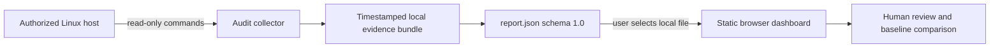

# JusticeForMe

JusticeForMe is a **read-only Linux configuration and privilege auditing project**. It inventories selected host-security indicators and produces a local evidence bundle with a compact `report.json` summary. A static GitHub Pages dashboard reads that summary entirely in the browser.

The implemented scope is deliberately narrow:

1. collect metadata and hashes from `/etc`;
2. enumerate privileged binaries, Linux file capabilities, administrative access paths, persistence locations, and package-integrity deviations;
3. write a timestamped local report directory and SHA-256 manifest; and
4. render summary metrics and review priorities from a user-selected `report.json`.

JusticeForMe does **not** remediate a host, transmit reports, determine attribution, establish compromise, or replace a qualified forensic examination.

## Safety and evidentiary limits

A finding is an indicator for investigation, not proof of malicious activity. Counts can vary because of operating-system family, installed software, administrative policy, containers, package-manager behavior, and legitimate local customization. Validate results against trusted package metadata, known-good hashes, approved change records, and preserved source evidence.

Run the collector only on systems you own or are explicitly authorized to inspect. The generated bundle can expose hostnames, account names, file paths, privilege relationships, package deviations, and configuration history; treat it as sensitive security material.

## Quick start

### Requirements

- Linux
- Bash
- Python 3
- standard userland tools such as `find`, `sort`, `sha256sum`, `awk`, `grep`, and `timeout`
- optional `getcap` support for Linux file-capability inventory
- one supported package verifier when available: `dpkg`, `rpm`, or `pacman`

### Run the collector

```bash
chmod +x audit/linux-privilege-audit.sh
sudo ./audit/linux-privilege-audit.sh
```

An optional first argument selects the output directory:

```bash
sudo ./audit/linux-privilege-audit.sh /secure/evidence/host-audit
```

Without an explicit path, the collector creates a timestamped directory under the current working directory.

### Review the report

Open the deployed GitHub Pages site or `docs/index.html`, choose the generated `report.json`, and inspect the summary. Parsing occurs locally in the browser; the dashboard does not upload the selected file.

The output bundle includes:

- `report.json`
- `/etc` metadata and SHA-256 inventories
- world-writable and executable `/etc` findings
- setuid/setgid binaries and Linux file capabilities
- administrative groups and sudo metadata
- persistence and dynamic-loader indicators
- package-manager integrity results
- `REPORT-SHA256SUMS.txt`, covering the generated report files

## Architecture at a glance



The collector and dashboard are intentionally separated. The collector requires host access and may be run with elevated privileges for completeness. The dashboard is static, has no backend, and receives data only through the browser file picker.

## Documentation

- [Architecture](ARCHITECTURE.md)
- [Design and interpretation model](DESIGN.md)
- [Security and evidence handling](SECURITY.md)
- [Developer onboarding and contribution guide](CONTRIBUTING.md)
- [Task chain](taskchain.md)
- [Release readiness](release.md)
- [Changelog](changelog.md)
- [GitHub Pages project guide](docs/guide.html)

## Repository layout

```text
audit/linux-privilege-audit.sh   Read-only audit collector
docs/index.html                  Browser dashboard
docs/app.js                      Schema validation and summary rendering
docs/styles.css                  Shared Pages styling
docs/guide.html                  Pages project and developer guide
.github/workflows/pages.yml      Static GitHub Pages deployment
ARCHITECTURE.md                  Components, boundaries, and data flow
DESIGN.md                        Collection and interpretation contracts
SECURITY.md                      Authorized-use and evidence guidance
CONTRIBUTING.md                  Developer onboarding and review checklist
taskchain.md                     Documentation and release work sequence
release.md                       Evidence-based release gates
changelog.md                     Repository change record
```

## Current scope boundaries

The current repository does not include automated remediation, remote collection, fleet management, continuous monitoring, malware classification, kernel telemetry, endpoint isolation, cloud ingestion, evidence signing, or external threat-intelligence correlation. Any such capability requires separate design, threat modeling, approval, and implementation work rather than being inferred from the present collector or dashboard.

## License and support status

No license or support commitment should be inferred unless the repository contains an explicit license and published support policy. Review those governance decisions before redistributing or presenting the project as production-supported software.