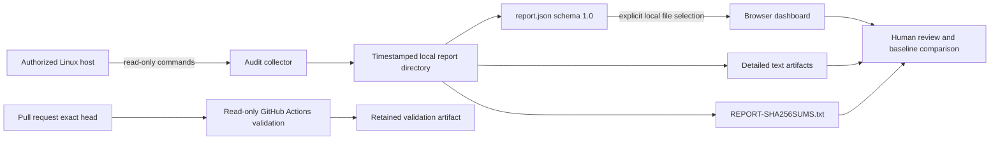

# JusticeForMe Architecture

Status: `DOCUMENTATION_ONLY — IMPLEMENTATION SCOPE UNCHANGED`

## System view

**Equivalent prose:** An authorized operator runs the collector on a Linux host. The collector reads configuration and privilege metadata and writes a timestamped directory on that same system. The directory contains the browser-facing `report.json`, detailed text artifacts, and a SHA-256 manifest. The operator explicitly selects `report.json` in the local dashboard; the browser renders indicators but does not upload the report. Human review compares the output with trusted package metadata, known-good baselines, and documented administrative changes. Repository changes are separately checked at the submitted pull-request head by a read-only workflow that retains validation evidence but cannot deploy Pages.

## Components and responsibilities

### Collector

`audit/linux-privilege-audit.sh` uses defensive shell settings and records:

- `/etc` metadata and file hashes;
- world-writable and executable `/etc` entries;
- setuid and setgid binaries;
- Linux file capabilities where `getcap` is available;
- UID 0 accounts, administrative groups, and sudo metadata;
- local systemd units, cron files, and dynamic-loader preload state;
- package-manager verification output for `dpkg`, `rpm`, or `pacman`; and
- six summary metrics in report schema `1.0`.

The collector writes only beneath the requested output directory. Commands that can fail because a path, package manager, privilege, or optional tool is absent are handled as incomplete evidence rather than proof of safety.

### Report directory

The report directory is the evidence handoff boundary. `REPORT-SHA256SUMS.txt` protects file identity after collection, but a hash manifest does not establish when a system state began, who caused it, whether a package change was authorized, or whether the collection was complete.

### Browser dashboard

The dashboard validates `schema_version === "1.0"`, renders six metrics, identifies whether root collection was complete, and lists collected artifacts. It uses fixed prioritization thresholds to focus review. These thresholds are presentation policy, not a forensic or compliance standard.

### Validation workflow

`.github/workflows/pages.yml` runs only for pull requests affecting the collector, dashboard, documentation, or workflow. It:

- checks out the submitted exact head with persisted credentials disabled;
- verifies that Pages write, OIDC, deployment, push, and manual-dispatch authority remain absent;
- checks shell, JavaScript, HTML structure, local assets, documentation links, and planning alignment;
- records deterministic evidence and SHA-256 input identities; and
- retains evidence for 30 days.

## Trust boundaries

| Boundary | Trusted input | Untrusted or incomplete input | Required response |
|---|---|---|---|
| Host to collector | Explicit operator authorization | Unknown host ownership or scope | Do not run |
| Collector to report | Command output and local filesystem observations | Permission-denied paths, absent tools, mutable live state | Mark incompleteness; preserve raw artifacts |
| Report to dashboard | Local schema `1.0` JSON | Malformed, future, or partial schemas | Reject or label incomplete |
| Dashboard to reviewer | Rendered indicators and artifact names | Threshold-derived severity as factual conclusion | Validate independently |
| Repository to CI | Exact pull-request head | Mutable branch assumptions or generated-tree changes | Fail closed |
| CI to release | Passing validation | Publication, deployment, forensic correctness, or compliance authority | Keep blocked |

## Failure modes

- **Non-root execution:** `root_complete` is false; findings may be incomplete.
- **Unsupported package manager:** package-integrity output records that no supported verifier was found.
- **Live-system drift:** the host can change during or after collection; the report is a point-in-time observation, not a sealed disk image.
- **Threshold mismatch:** dashboard thresholds may not fit a particular distribution or environment.
- **Sensitive disclosure:** report contents can expose host and privilege information if published.
- **Hash overclaim:** matching report hashes confirm file identity only, not truth, completeness, or chain of custody.

## Extension rules

New collectors, metrics, schemas, or rendering behavior require:

1. an explicit scope and non-goal statement;
2. backward-compatibility or migration guidance;
3. synthetic fixtures only in public Git;
4. updated schema and evidence documentation;
5. accessibility review for every new control or visualization; and
6. exact-head validation without adding deployment or credential authority.
