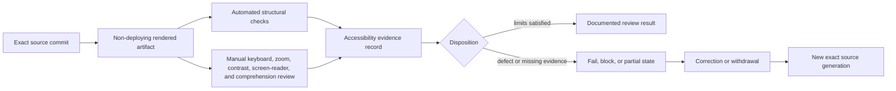

# Accessibility and Review Evidence

Status: `DOCUMENTED_NOT_CERTIFIED`

JusticeForMe documents an accessibility review protocol for its static dashboard, project guide, repository documentation, and any retained rendered artifact. This protocol does not certify accessibility, authorize GitHub Pages publication, approve collector execution, or convert a documentation check into forensic, security, privacy, or release approval.

## Review surfaces

Each surface is reviewed and recorded separately.

| Surface | Current form | Primary accessibility risks | Evidence boundary |
|---|---|---|---|
| Audit dashboard | `docs/index.html`, `docs/app.js`, `docs/styles.css` | File-input labeling, focus order, status announcements, table/card interpretation, error recovery, zoom and reflow | Exact source plus the exact rendered dashboard artifact |
| Project guide | `docs/guide.html`, `docs/styles.css` | Heading order, navigation, tables, long procedures, links, zoom and reflow | Exact source plus the exact rendered guide artifact |
| Repository Markdown | README and `docs/reference/*.md` | Link clarity, heading hierarchy, diagram alternatives, code-block comprehension | Exact source commit and rendered repository view |
| Generated audit evidence | Local reports and artifacts | Sensitive data, dense technical output, ambiguous missing-state semantics | Excluded from public review artifacts; use synthetic or minimized fixtures only |
| Future portfolio adapters | Not implemented | Authority-state comprehension, error communication, identity and provenance ambiguity | Separate review required after an approved interface exists |

A pass for one surface is not transferable to another surface, browser, viewport, input method, operating system, or assistive technology.

## Review-state vocabulary

Use one of these states for every evidence record:

- `NOT_REVIEWED` — no qualifying review evidence exists.
- `PARTIAL` — some required checks were completed, with the remainder listed.
- `PASS` — the named checks passed for the exact artifact and environment.
- `FAIL` — one or more named checks failed.
- `BLOCKED` — review could not proceed because an artifact, environment, tool, permission, or reviewer was unavailable.
- `UNKNOWN` — evidence is insufficient or contradictory.
- `SUPERSEDED` — a later artifact or correction replaced the reviewed target.
- `WITHDRAWN` — the evidence or claim was intentionally retracted.
- `CORRECTED` — a documented defect was repaired and linked to new evidence.

`PASS` means only that the recorded checks passed. It does not mean universal conformance or certification.

## Evidence flow



In prose: bind the review to one exact source generation, render a non-deploying artifact, run automated structural checks, conduct the required manual reviews, record both the successes and limitations, and issue only a bounded disposition. A defect, missing test, moved head, or changed rendering environment requires a fail, blocked, partial, superseded, or corrected record rather than silent reuse of earlier evidence.

## Required evidence fields

Every accessibility review record must include:

- repository and full source commit;
- reviewed paths and surface identifiers;
- workflow run and rendered-artifact identifier, when applicable;
- artifact digest and creation time;
- browser, operating system, viewport, zoom level, and display scaling;
- input methods used;
- assistive technology and version, when used;
- automated checks and tool versions;
- manual procedures and observed results;
- defects, limitations, unsupported combinations, and blocked checks;
- reviewer identity or review role;
- correction, withdrawal, and supersession links;
- publication, release, collector, remediation, and authority status.

Example documentation-only record:

```yaml
schema: justiceforme.accessibility-review.v1
status: PARTIAL
source:
  repository: aevespers2/JusticeForMe
  commit: FULL_COMMIT_SHA
surface:
  id: static-dashboard
  paths:
    - docs/index.html
    - docs/app.js
    - docs/styles.css
artifact:
  id: NON_DEPLOYING_ARTIFACT_ID
  sha256: ARTIFACT_DIGEST
environment:
  browser: NAME_AND_VERSION
  operating_system: NAME_AND_VERSION
  viewport: 1280x720
  zoom: 200-percent
checks:
  keyboard: PASS
  focus_visibility: PASS
  screen_reader: NOT_REVIEWED
  contrast: PARTIAL
  reflow_200: PASS
  reflow_400: NOT_REVIEWED
  reduced_motion: PASS
  error_recovery: PARTIAL
limitations:
  - Manual screen-reader review remains pending.
authority:
  accessibility_certification: denied
  pages_publication: denied
  collector_execution: denied
  host_inspection: denied
  remediation: denied
  release: denied
```

This template is synthetic and non-executable. It contains no host report, credential, device identity, or private evidence.

## Review protocol

### Keyboard and focus

- Reach every interactive control using the keyboard alone.
- Confirm a logical focus order and visible focus indicator.
- Confirm the file input has a programmatically associated label.
- Confirm the demonstration control is reachable and operable.
- Confirm status changes are announced without moving focus unexpectedly.
- Confirm errors leave a usable recovery path.
- Confirm no keyboard trap exists.

### Screen-reader and semantic structure

- Confirm one clear page title and one primary `h1`.
- Confirm landmarks, headings, lists, tables, labels, and status regions expose meaningful names and roles.
- Confirm metric names, values, and severity are understandable without relying on visual position or color.
- Confirm report errors and unsupported-schema messages are announced.
- Confirm the architecture and evidence-flow diagrams have complete prose equivalents.
- Confirm link text remains understandable outside its surrounding sentence.

### Zoom, reflow, and responsive use

- Review at 200% and 400% zoom.
- Confirm controls, status text, metrics, navigation, tables, code blocks, and guidance reflow without loss of information or two-dimensional scrolling except where intrinsically necessary.
- Confirm touch targets and spacing remain usable on narrow viewports.
- Confirm long paths, hashes, and commands wrap or scroll without covering adjacent content.

### Contrast and non-color communication

- Check text, controls, borders, focus indicators, links, and status elements against the rendered background.
- Confirm `ok`, `warn`, and `high` states include text and do not depend only on border color.
- Confirm selected, current, failed, blocked, and unknown states remain distinguishable in forced-colors or high-contrast modes where available.

### Motion and timing

- Confirm the site works with `prefers-reduced-motion` enabled.
- Do not add essential timed interactions, auto-advancing content, or animation-dependent meaning.
- Confirm large local files and parse errors do not leave the interface in an unexplained busy state.

### Cognitive access and risk communication

- Keep procedures stepwise and state prerequisites before commands.
- Distinguish observation, heuristic severity, evidence, interpretation, proposal, approval, and remediation.
- Explain partial, unsupported, timed-out, failed, and unknown collection states without representing them as clean results.
- Keep the warning that findings are indicators rather than proof near the relevant output.
- Use synthetic examples for public documentation and routine review.

### Privacy and local-only behavior

- Use only synthetic or minimized fixtures during accessibility review.
- Confirm the dashboard makes no network request while loading a report.
- Do not include real hostnames, usernames, file paths, privilege relationships, credentials, or raw audit output in public evidence.
- Treat screenshots, recordings, browser logs, and assistive-technology transcripts as potentially sensitive review artifacts.

## Automated checks versus certification

Automated validation may verify source identity, required landmarks, labels, local links, local scripts and styles, deployment prohibition, and required documentation markers. It cannot establish screen-reader usability, comprehension, sufficient contrast in every environment, 400% reflow, cognitive accessibility, or conformance to every applicable standard.

The workflow therefore records `DOCUMENTED_NOT_CERTIFIED`. A later certification claim requires an approved standard, scope, reviewer, exact rendered artifact, retained manual evidence, correction policy, and explicit human approval.

## Correction, withdrawal, and supersession

- A moved source head invalidates currentness until the descendant is reviewed.
- A rendering, stylesheet, JavaScript, content, browser, or workflow change requires impact analysis and renewed checks.
- A discovered defect changes the affected record to `FAIL`, `PARTIAL`, `CORRECTED`, or `WITHDRAWN` as appropriate.
- Preserve the original record and link the correction; do not overwrite history as though the defect never existed.
- Withdraw any claim that cannot be reproduced from the recorded source and artifact.

## Fail-closed stop conditions

Stop review or publication disposition when:

- the exact source or rendered artifact cannot be identified;
- a public artifact contains real audit evidence or sensitive host data;
- keyboard access, focus, labeling, status announcement, or error recovery is materially broken;
- critical meaning depends on color, motion, pointer use, or visual layout alone;
- documentation represents automated checks as accessibility certification;
- a historical pass is presented as evidence for a moved head;
- publication, collector execution, remediation, or release authority is implied by the review record.

## Reviewer onboarding

1. Read the README, project overview, architecture, report contract, and operations guide.
2. Confirm the exact source generation and obtain the non-deploying rendered artifact.
3. Use synthetic fixtures only.
4. Perform automated and manual checks independently.
5. Record limitations and unsupported combinations explicitly.
6. Link every defect to a correction, withdrawal, or accepted-risk disposition.
7. Keep accessibility review separate from security, privacy, forensic correctness, publication, integration, and release approval.
