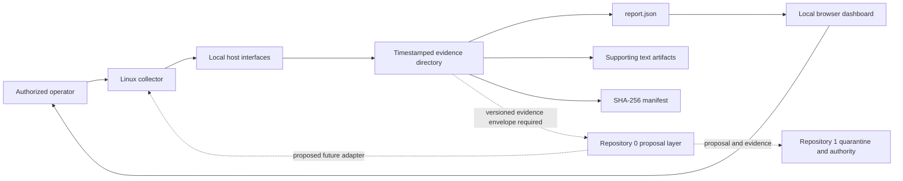

# Architecture and Trust Boundaries

## Component model

Solid arrows describe the implemented local flow. Dashed arrows describe proposed portfolio integration and are not active capabilities.

## Runtime sequence

1. The operator chooses an output directory or accepts the timestamped default.
2. The collector determines whether it is running as root.
3. It reads selected local filesystem, identity, group, privilege, persistence, loader, and package-integrity surfaces.
4. It writes raw or summarized artifacts into the output directory.
5. Python serializes report schema `1.0`.
6. The collector hashes the generated files into `REPORT-SHA256SUMS.txt`.
7. The operator opens the dashboard locally and selects `report.json`.
8. JavaScript validates the schema version, renders metrics, applies fixed triage thresholds, and lists artifacts.

## Trust zones

| Zone | Assets | Trust assumption | Boundary rule |
|---|---|---|---|
| Audited Linux host | Files, package database, accounts, privileges | Potentially misconfigured or compromised | Treat all observations as untrusted evidence |
| Collector process | Script, shell, Python, system utilities | Trusted only to the degree its exact source and runtime are verified | Record versions and limitations; do not infer correctness from execution alone |
| Evidence directory | Report JSON, artifacts, manifest | Locally generated and mutable unless separately preserved | Preserve before interpretation or transport |
| Browser dashboard | Local HTML, CSS, JavaScript | Presentation and thresholding only | No upload, authority, or proof claims |
| Repository `0` | Proposed observation orchestration and remediation planning | Not authoritative for approved baseline | Must emit versioned proposal and evidence envelopes |
| Repository `1` | Proposed baseline and capability authority | Candidate canonical decision point | Must independently validate identity, freshness, schema, policy, and replay state |

## Data flow

The collector intentionally separates detailed artifacts from the compact dashboard summary. The dashboard reads only `report.json`; it does not automatically read or verify the supporting artifacts or the manifest. Therefore a displayed metric is not evidence that the named supporting artifact exists, matches the manifest, or was collected successfully.

A future integration envelope should bind at least:

- collector repository and exact commit;
- collector file hash;
- invocation arguments and effective identity;
- host/device identity claim and ownership scope;
- operating-system and package-manager information;
- start and completion timestamps with clock source;
- root completeness and per-check status;
- report schema and artifact hashes;
- errors, timeouts, skipped checks, and unsupported checks;
- evidence-directory manifest hash;
- transformation identity when Repository `0` creates a proposal.

## Failure model

| Failure | Current behavior | Required interpretation |
|---|---|---|
| Collector not run as root | Continues and sets `root_complete=false` | Report is partial |
| Optional tool missing | Some files are empty or contain an unsupported notice | Capability is unknown or unsupported |
| `getcap` timeout or error | Empty or partial file may result | Do not interpret zero findings as verified absence |
| Package verification timeout or error | Output is retained and execution continues | Count may mix findings with errors |
| Filesystem read denied | Commands often suppress errors | Missing evidence must not become compliance |
| Host clock incorrect | Timestamp still generated | Freshness is uncertain |
| Evidence directory modified later | Manifest can be recomputed by anyone with write access | Preserve independently before relying on it |
| Dashboard threshold reports `ok` | Count is below a fixed heuristic | This is not a signed baseline comparison |

## Security invariants

- Collection is read-only with respect to the audited system, aside from creating the chosen output directory.
- The dashboard must process files locally and make no network request.
- Findings remain indicators, not attribution or proof.
- Missing evidence fails closed for portfolio integration.
- Repository `0` cannot turn a JusticeForMe report into remediation authority by itself.
- Repository `1` cannot accept a report as canonical without device identity, schema, provenance, freshness, and policy validation.
- No future integration may require embedding live credentials in the report or repository.
